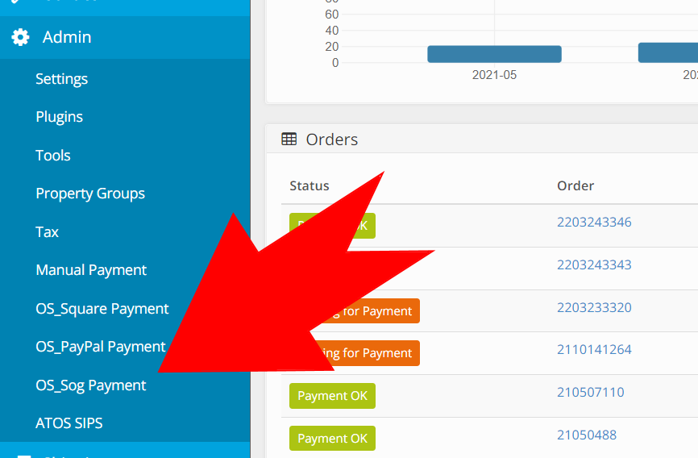
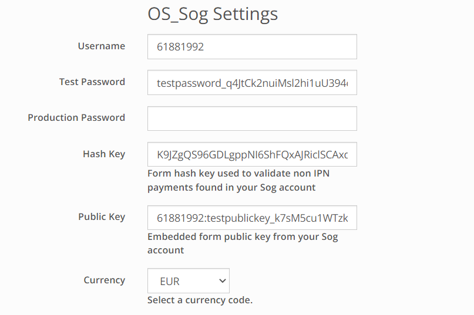
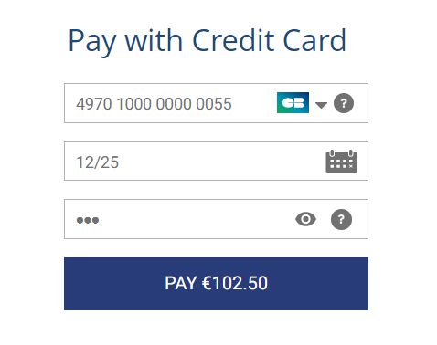

# OS_Sog
A DNN OpenStore payment provider plugin

## Getting Started
This is a payment provider plugin for . It will enable any 
DNN 9.4+ site running OpenStore to accept CC payments into their [SogeEcommerce](https://sogecommerce.societegenerale.eu/doc/en-EN/) account.  You must 
have a valid merchant account and a [javascript client](https://sogecommerce.societegenerale.eu/doc/en-EN/) 
 key for this provider to work.

### About the Install

The module installation will add a payment provider option to your DNN Open Store site.

### Installing
1. Backup your db and DNN site.  Install into DNN as a normal module.  The installation process will ensure that your 
DNN OpenStore installation is using at least v8.5.2 of the [NBrightTemplateSys](https://github.com/nbrightproject/NBrightTS). 
v8.5.2 is the first NBrightTemplateSys version to include encryption support for text 
inputs.  It's required for encrypting your Sog credentials.  

2. Go into Open-Store BO>Admin, the "OS_Sog" option should be listed.

3. See Sog's [developers](https://https://www.societegenerale.com/) portal for your username, password, public key 
and hash keys.  These are required for the form based payments.  If you are using the IPN you are not required 
to enter the hash key.

4. Configure your OpenStore Back Office plugin settings for the Sog Ecommerce plugin with the credentials from step 3. 

5. Select the sandbox mode when you are testing against your sandbox account.  Uncheck this 
box when you are ready to send requests to your actual Sog account.  ***You must have 
IIS bound to localhost for testing***.  Urls such as dnndev.me or dnn.local won't work.  Your 
production server must be using https.

---

*Congratulations*! The gateway should now be ready and your customers can purchase securely with 
Sogecommerce during your OpenStore checkout process.

---

### Development
 1. Backup your db and DNN site.  Install the module into your development enviroment.
 2. Clone the repo to your /DesktopModules/NBright/ directory.
 2. Your development environment IIS server must bind your DNN site to localhost 
	otherwise the payment form will not work using the sandbox(untested).  
 3. See the [Sog](https://www.societegenerale.com/) developer portal for your api User Name, Passwords other credentials.
 4. Configure your settings for the Sog plugin.  You will need a User Name, Password, Public Key and Hash Key for 
	form based hash validation.  IPN set ups do not require a hash key to be entered.
 5. You should be able to compile and attach the debugger at this point.
 6. You can test charges against your sandbox using the card values provided 
	by the embedded form plugin.

### Dependencies

 * none
 
 There is no sql provider with this module install but it's best to still *follow best practice and back up both 
 your db & file system before installing*.  

## History
This module borrowed from OS_Square for the implementation of the Sogecommerce embedded payment 
form which is the successor to OS_Sips. The plugin provides support for form and IPN payment options.

## Authors
 [i502 Club](https://www.i502.club)

[Agencie Sesame](https://www.agence-sesame.fr)

This project was built using templates provided for the OpenStore community, examples which 
can be found on the Sogecommerce developers portal, and code from the OS_Square plugin.

## License
This project is licensed under the MIT License - see the [LICENSE.txt](LICENSE.txt) file for details

## Acknowledgments
* All the contributors to [DNN](https://github.com/dnnsoftware/Dnn.Platform) & [OpenStore]( https://github.com/openstore-ecommerce/OpenStore) 

## Contribute
You can create an issue or submit a pull request to help make the plugin work better.
